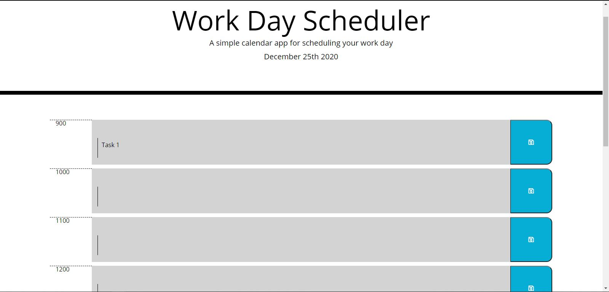
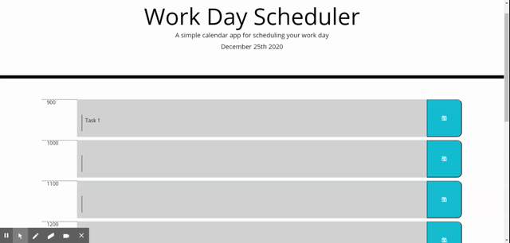

# Work Day Scheduler Starter Code
## Table of Contents
- [Description](##Description)
- [Installation](##How-to-install)
- [Usage](##Usage-information)
- [Contributing](##how-to-contribute)
- [Tests](##How-to-test-the-application)
- [GitHub](##GitHub-profile)
- [Contact](##Contact-me-via-email)
## Description
> A simple calendar app for scheduling your work day using military time.

## How To Install The Application
> Simply open the page using the link below and start adding tasks.
https://alexandraws29.github.io/work-day-scheduler/
## Usage Information
> Type a task next to the black line in each of the timed squares. You can edit tasks and save all tasks. Use this for any scheduling needs.
## How To Contribute
> If you would like to make contributions, then please contact me through GitHub.
## How To Test The Application
> Open the program and add a few tasks. You can also edit a task, and if you hit refresh the tasks will be saved.
## GitHub Profile
> github.com/alexandraws29 
## Contact Me Via Email
> <alexandraws29@outlook.com>
    